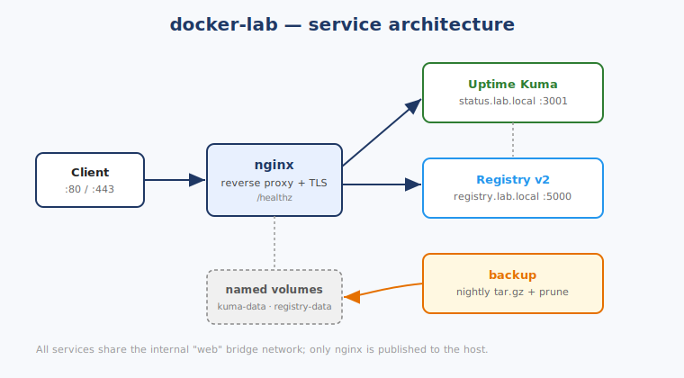
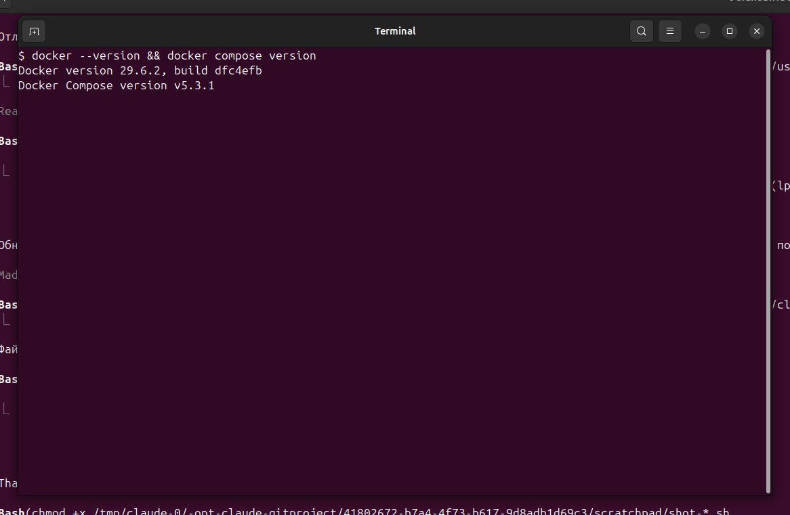
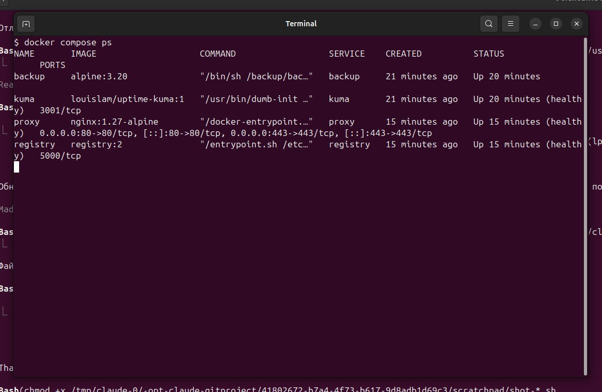
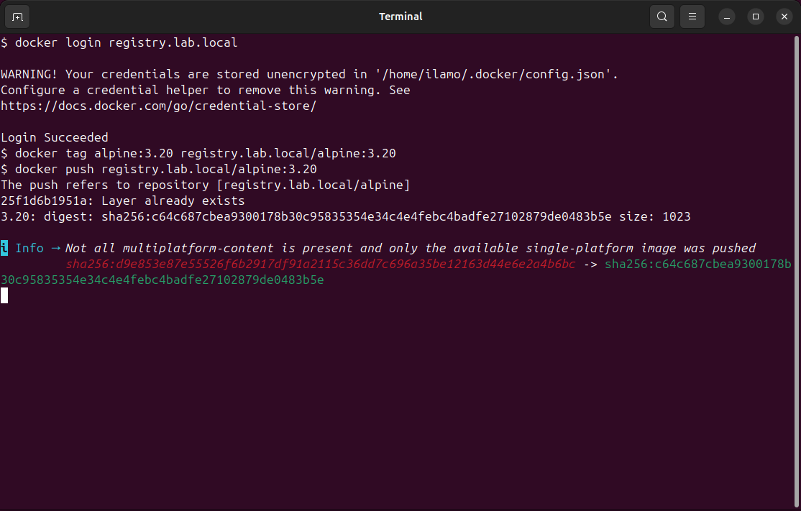
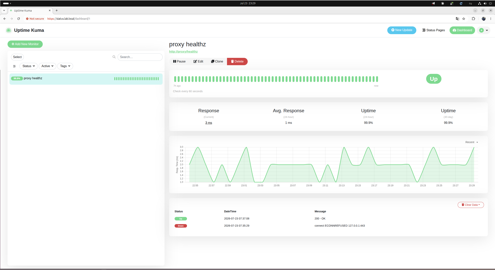

# docker-lab

A small, self-contained Docker Compose stand that mirrors how I run internal web
services in a homelab: **one nginx reverse proxy in front, TLS everywhere, a private
registry, a status page, and automated backups** of the stateful volumes.

Everything is reachable through a single entry point (nginx). Only ports 80/443 are
published to the host — the application containers stay on an internal bridge network.



## Services

| Service | Image | Role | URL |
|---|---|---|---|
| `proxy` | `nginx:1.27-alpine` | Reverse proxy, TLS termination, `/healthz` | `:80`, `:443` |
| `kuma` | `louislam/uptime-kuma:1` | Uptime / status monitoring | `https://status.lab.local` |
| `registry` | `registry:2` | Private Docker registry (basic-auth) | `https://registry.lab.local` |
| `backup` | `alpine:3.20` | Nightly `tar.gz` of named volumes + retention prune | — |

## Layout

```
docker-lab/
├── docker-compose.yml
├── Makefile              # certs / auth / up / down / logs helpers
├── .env.example
├── nginx/
│   └── conf.d/
│       └── default.conf  # proxy + two vhosts (status, registry)
├── backup/
│   └── backup.sh         # loop-based nightly backup with prune
└── docs/
    ├── architecture.svg
    └── RUN.md            # step-by-step: install docker, run, screenshot
```

## Setup

```bash
cp .env.example .env
make certs      # self-signed cert (status.lab.local + registry.lab.local)
make auth       # registry basic-auth (ilija-s / change-me)
echo "127.0.0.1 status.lab.local registry.lab.local" | sudo tee -a /etc/hosts
make up         # docker compose up -d
make ps         # all services should report (healthy)
```

See [`docs/RUN.md`](docs/RUN.md) for the full walkthrough including Docker install.

## Verify

```bash
curl -s http://localhost/healthz            # -> ok
docker login registry.lab.local             # ilija-s / change-me
docker tag alpine:3.20 registry.lab.local/alpine:3.20
docker push registry.lab.local/alpine:3.20
```

## Known issues found & fixed

Standing this up end-to-end (Docker install → certs → `compose up` → push) surfaced
two healthcheck bugs in `docker-compose.yml` — both showed the affected service stuck
`unhealthy` in `docker compose ps` even though it worked fine otherwise:

- **`proxy`**: the healthcheck hit `http://localhost/healthz`, but `localhost`
  resolves to `::1` first inside the container while nginx only binds `0.0.0.0` —
  every probe failed with "connection refused". Fixed by probing `127.0.0.1` instead.
- **`registry`**: the healthcheck hit `/v2/` with no credentials, but once
  `REGISTRY_AUTH=htpasswd` is set that endpoint requires Basic Auth — every probe got
  401. Fixed by sending the same `ilija-s` / `change-me` credentials as an
  `Authorization` header.

## Backups

The `backup` container archives `kuma-data` and `registry-data` once every `INTERVAL`
seconds (24h by default) into `backup/out/*.tar.gz` and prunes anything older than
`RETENTION_DAYS`. Run a one-off with `make backup`.

## Notes

- Certificates and `backup/out/` are git-ignored — the repo ships configuration only.
- The same layout scales to a multi-host setup, which is what
  [`ansible-lab`](https://github.com/youngnlit-s5/ansible-lab) provisions automatically.

## Screenshots

Captured from a real run of the stand.

**`docker --version && docker compose version`**


**`docker compose ps` — all four services `healthy`**


**`docker login` + `tag` + `push` of `alpine:3.20` to the private registry**


**Uptime Kuma with a live monitor green**

